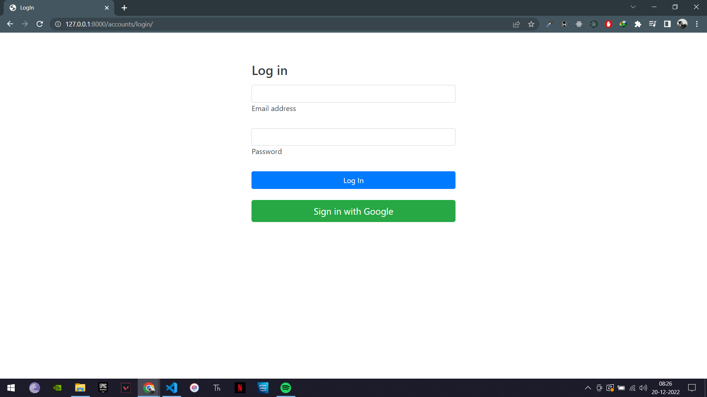
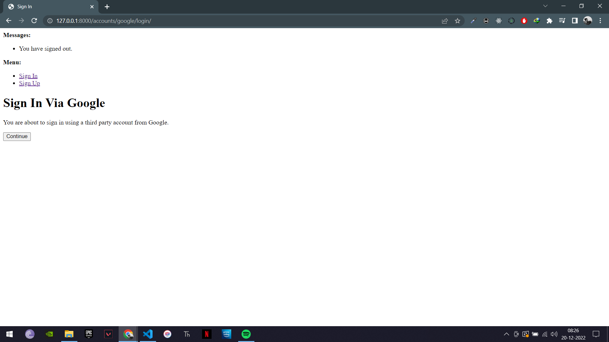
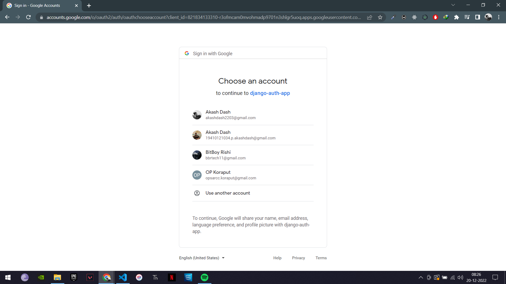
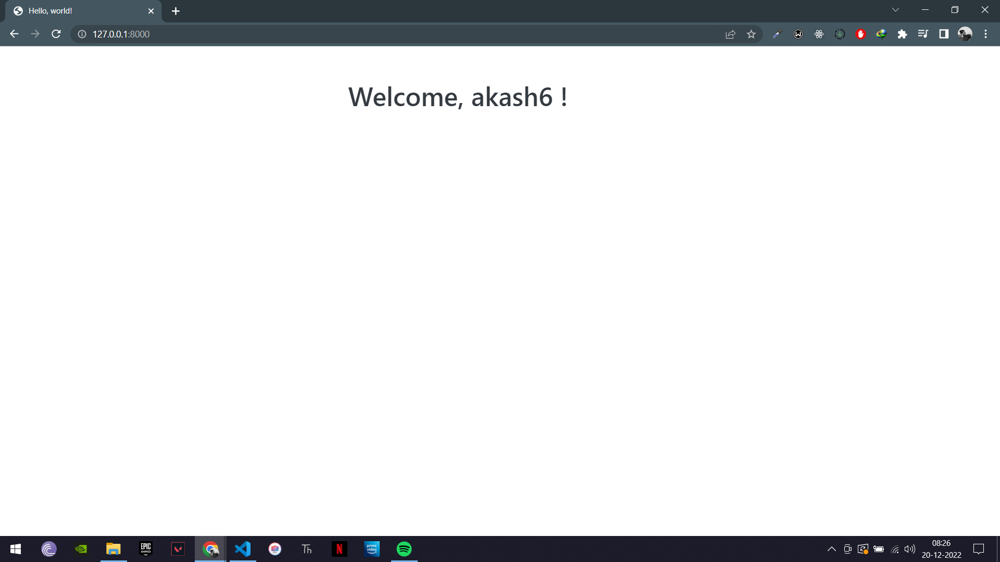
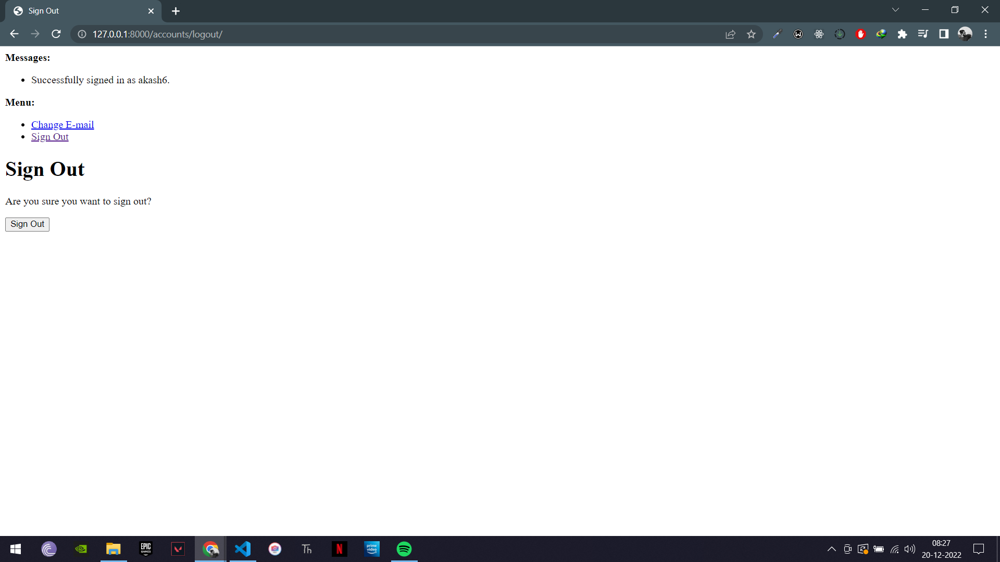
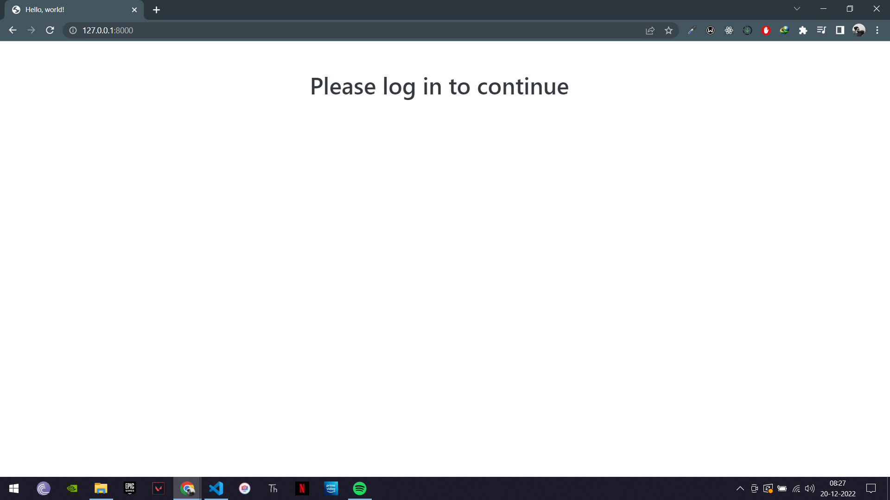

# OAuth-Django
<h3>LogIn page (endpoint: accounts/login/) </h3>

<h3>Confirmation page by allauth (endpoint: accounts/google/login/) </h3>

<h3>Google Auth Server Page</h3>

<h3>Homepage after logging in and fetched the username from google</h3>
<h4>In akash6, 6 is added since 6 users have same name akash that has been incremented by django</h4>

<h3>LogOut page (endpoint: accounts/logout/) </h3>

<h3>Homepage when no user is logged in</h3>

